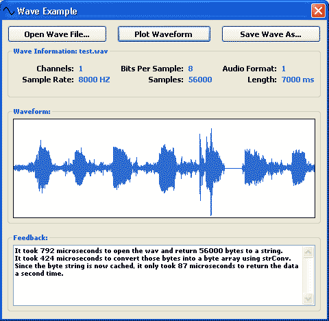



## Wave Class \- Easily read and write RIFF PCM WAVE format\.

### Description

The purpose of this code is to provide an easy drop-in solution to reading and writing RIFF WAVE file formats.

The clsWave class requires no external dependencies, and provides only the necessary functions for retrieving WAVE data, extended wave information, and writing WAVE files

I had looked at several examples on Planet Source Code to do this, but many had flaws in them (one actually looped to find a fixed-position value in the header), were inefficient, or did not conform well to my own uses. As a result, I've spent the evening writing this class.

It can read and write small wave files (~ 50K) within a millisecond or two on any modern computer.

My main objective in writing this class was reusability, and I believe I have achieved that quite well. You simply open a file, retrieve the bytes directly in a byte array. To write a wave, you must only set the properties of the class and feed it a byte array (or, optionally specify the header parameters and leave the current instance's headed untouched).

I have written this class to be about as efficient and quick as it can be, however if anyone notices something that can be improved (aside from the plotting - this was not the goal, only to demonstrate the class), please leave me a note. Currently only supports a static PCM format (44 byte header). Thanks to Robert's comment, I've learned there is alot more to the header than I assumed. The submission will be updated within a week or thereabouts to add support for all PCM variations - but I do not plan to handle things such as MP3 and other such formats, only PCM.
 
### More Info
 

             |
---                |---
**Submitted On**   |2006-09-07 02:59:26
**By**             |[Nick Williams](https://github.com/Planet-Source-Code/PSCIndex/blob/master/ByAuthor/nick-williams.md)
**Level**          |Intermediate
**User Rating**    |4.8 (43 globes from 9 users)
**Compatibility**  |VB 6\.0
**Category**       |[Files/ File Controls/ Input/ Output](https://github.com/Planet-Source-Code/PSCIndex/blob/master/ByCategory/files-file-controls-input-output__1-3.md)
**World**          |[Visual Basic](https://github.com/Planet-Source-Code/PSCIndex/blob/master/ByWorld/visual-basic.md)
**Archive File**   |[Wave\_Class201843972006\.zip](https://github.com/Planet-Source-Code/nick-williams-wave-class-easily-read-and-write-riff-pcm-wave-format__1-66479/archive/master.zip)

### API Declarations

SysAllocStringByteLen and RtlMoveMemory - used for quickly allocating a string to read data into from file.

